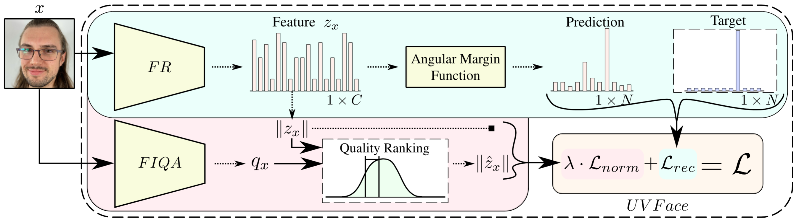
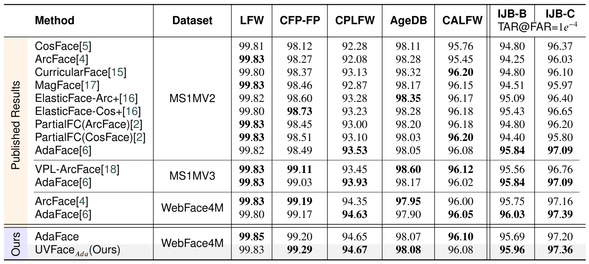
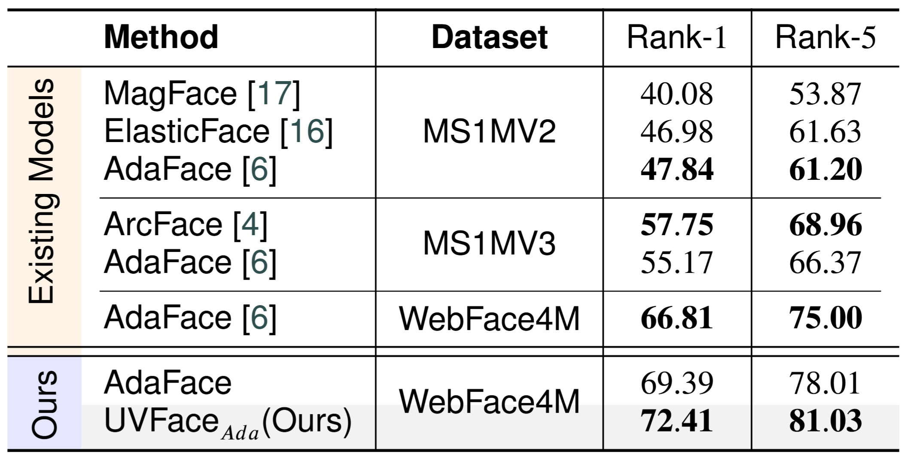
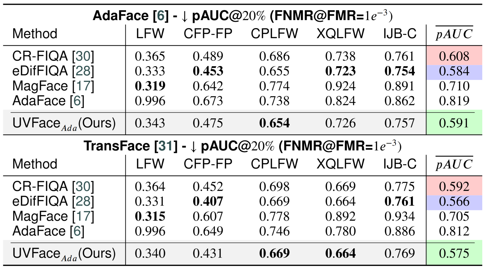

# Official repository of the paper: "UVFace: Utility Driven Video-based Face Recognition".


This is the official repository of the paper  ["UVFace: Utility Driven Video-based Face Recognition"](https://www.sciencedirect.com/science/article/pii/S2405959526000871) published in ICT Express.


---

## Table of Contents 

- [Official repository of the paper: "UVFace: Utility Driven Video-based Face Recognition".](#official-repository-of-the-paper-uvface-utility-driven-video-based-face-recognition)
  - [Table of Contents](#table-of-contents)
  - [1. Overview](#1-overview)
    - [1.1 Abstract](#11-abstract)
    - [1.2 Methodology](#12-methodology)
    - [1.3 Results](#13-results)
  - [2. Setup](#2-setup)
    - [2.1 Environment](#21-environment)
    - [2.2 Training](#22-training)
    - [2.3 Inference](#23-inference)
    - [2.4 Pretrained Weights for Inference](#24-pretrained-weights-for-inference)
  - [3. Citation](#3-citation)


## 1. Overview

### 1.1 Abstract

Face recognition methods are primarily designed for single-image analysis, even though video-based recognition has seen a dramatic increase in popularity in edge security and surveillance applications. Typically, a video template is constructed from the features of individual frames. Feature norms are commonly used as weights in the construction process, as they correlate well with the usefulness of samples for recognition. Classical training approaches directly optimize only the angular distances, in turn also guiding the feature norms. This can lead to suboptimal alignment between feature norms and the usefulness (utility) of samples, resulting in subpar video performance. Motivated by this insight, we propose the UVFace methodology, which presents an extended feature norm alignment branch. Through careful design of the quality ranking step, which produces feature norm labels and a new feature norm loss, UVFace improves performance over the reproduced AdaFace baseline on video-oriented benchmarks while retaining strong image-based performance.  

### 1.2 Methodology



__Overview of UVFace.__ Standard face recognition training extracts a feature vector z<sub>x</sub> of sample x using a backbone model FR. Then, using an angular margin function and the softmax loss L<sub>rec</sub>, the loss value is calculated. UVFace introduces a new branch and, consequently, a new loss term. In the second branch, an auxiliary technique FIQA first extracts the quality score q<sub>x</sub>, used for generation of a target feature norm ||z<sub>x</sub>||, using the Quality Ranking step. The label is then used by the new feature norm loss term L<sub>norm</sub>, which, in combination with the softmax term, forms the final loss value.


### 1.3 Results

Face recognition experimental results on small- and large-scale benchmarks. We show the performance of state-of-the-art techniques using verification accuracy (small-scale) and TAR@FAR = 10<sup>-4</sup> (large-scale). The best results for each benchmark and training dataset are highlighted. For the published results, all tied best results are marked.



Face recognition experimental results on the video-based DroneSURF benchmark. We show the performance of the models using the Rank-N metric. The best results for each benchmark and training dataset are highlighted.



Quality assessment experimental results. On the left, we show the ranking of images along with their saliency maps, and on the right, the EDC curves measuring the FNMR@FMR = 10<sup>-3</sup>. Our technique (in blue) has its Area Under the Curve filled, for easier comparison.



## 2. Setup


### 2.1 Environment 

We suggest using [conda](https://www.anaconda.com/docs/getting-started/miniconda/main), for easier environment setup.

- Create a new conda environment:
```
  conda create -n uvface python=3.10
  conda activate uvface
```
- Install PyTorch and TorchVision for your platform from the official selector at [pytorch.org](https://pytorch.org/get-started/locally/). For example, for CUDA 12.4:
```
  pip install torch torchvision --index-url https://download.pytorch.org/whl/cu124
```

- Install the remaining Python dependencies:
```
  pip install -r requirements.txt
```

- Python dependencies used by the repository:
  - `accelerate`
  - `braceexpand`
  - `numpy`
  - `PyYAML`
  - `scikit-learn`
  - `wandb`
  - `webdataset`

- System dependency:
  - `curl` must be available on `PATH`, because the training pipeline streams WebDataset shards through `pipe:curl ...`.

### 2.2 Training 

Run the training using:
```bash
accelerate launch src/train.py -c src/configs/train_default_webface4m.yaml
```

Some important config fields to review before launching:
- `accelerator_config`, `dataset_config`, and `augmentation_config` point to the three YAML files that define runtime, data, and augmentation settings.
- `save_loc`, `resume`, and `checkpoint` control where checkpoints are written and whether training starts fresh or resumes.

The default dataset config expects the WebFace4M training set and validates on `lfw`, `cplfw`, and `xqlfw`.

### 2.3 Inference

Run the inference using:
```bash
python3 src/inference.py -c src/configs/inference_default.yaml
```

Some important config fields to review before launching:
- `weights_path` must point to the feature extractor checkpoint you want to use.
- `input_images` accepts individual files or directories, and `recursive` controls whether nested folders are scanned.
- `output_pickle`, `device`, `device_id`, and `mixed_precision` control where embeddings are saved and which hardware/precision mode is used.

### 2.4 Pretrained Weights for Inference

Download the pretrained feature extractor checkpoint from [here](https://unilj-my.sharepoint.com/:u:/g/personal/zbabnik_fe1_uni-lj_si/IQD4aN3PbhgNTIRw4o3ubtVOAapt1AbhHS8o2raE1jLTTlw?e=8Pj37r).

Place the downloaded file under `src/weights` and name it `feature_extractor.pth` so it matches the default inference config:

```bash
mkdir -p src/weights
mv /path/to/downloaded_checkpoint.pth src/weights/feature_extractor.pth
```

The default inference config already points to this location:

```yaml
weights_path: "src/weights/feature_extractor.pth"
```

If you keep the checkpoint under a different name or location, update `weights_path` in `src/configs/inference_default.yaml` accordingly.

## 3. Citation

If you use this repository, please cite the paper:

```bibtex
@article{uvface_ict,
title = {UVFace: Utility Driven Video-based Face Recognition},
journal = {ICT Express},
year = {2026},
doi = {https://doi.org/10.1016/j.icte.2026.05.014},
author = {Žiga Babnik and Peter Peer and Vitomir Štruc},
}
```
